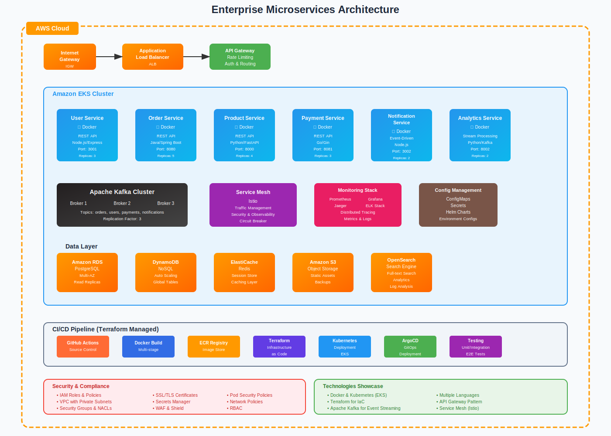

# Enterprise Microservices System

Modern cloud-native microservices architecture demonstrating:

- Multi-language services (Node.js, Java, Python, Go)
- Kubernetes orchestration
- Event-driven architecture with Kafka
- CI/CD automation
- Infrastructure as Code

## Architecture

## Getting Started
[Development setup instructions...]